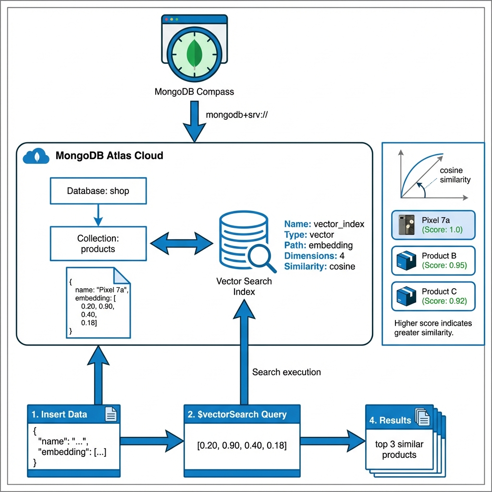
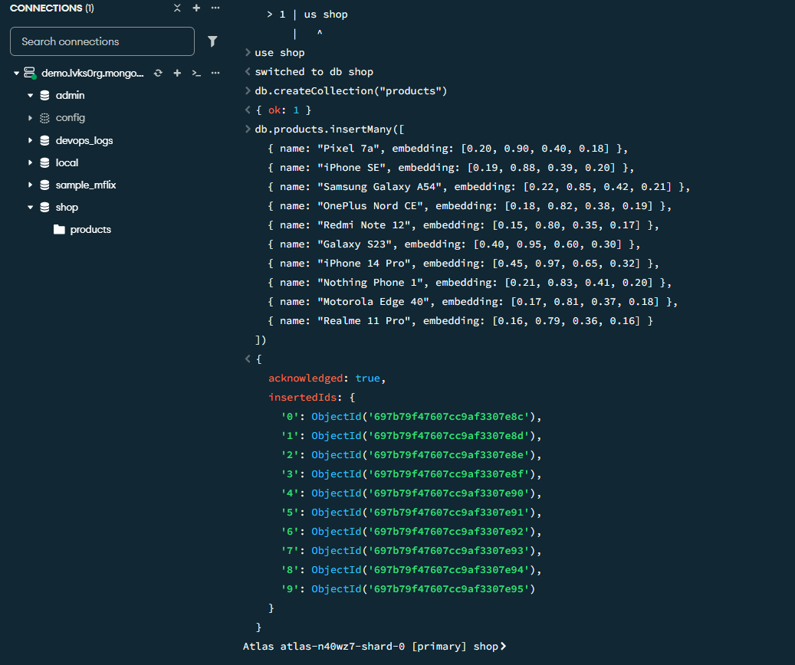
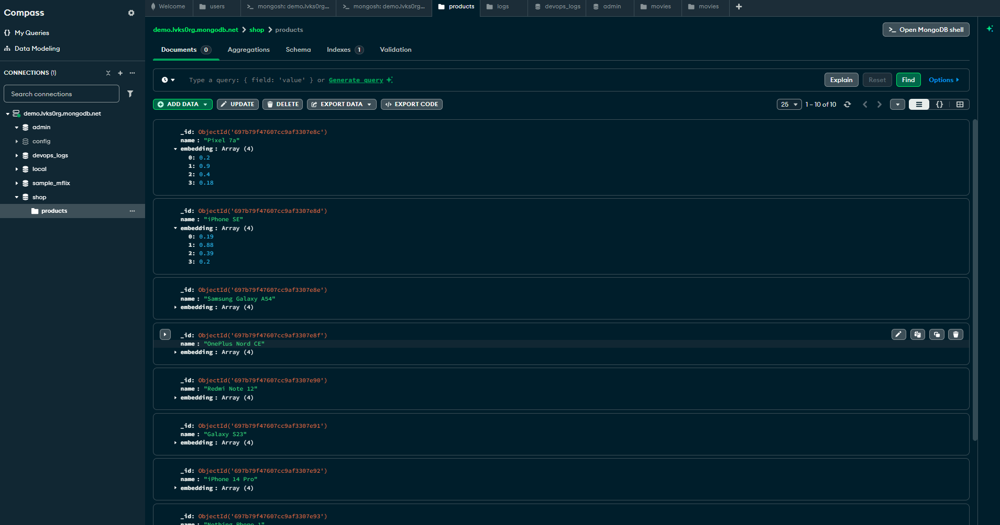
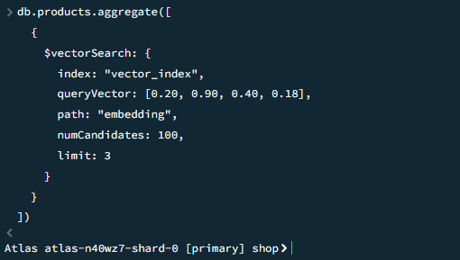

# MongoDB Vector Search Demo


A comprehensive demonstration of **Vector Search capabilities in MongoDB Atlas**, showcasing semantic similarity search using vector embeddings on a real-world product catalog.

---

## Overview

This project demonstrates how to implement **meaning-based search** using MongoDB's Vector Search feature. Instead of traditional keyword matching, vector search understands the semantic meaning of your data, enabling more intelligent and context-aware search results.

### What is Vector Search?

Vector Search allows you to:
- Store high-dimensional vector embeddings alongside your data
- Perform similarity searches based on semantic meaning
- Find items that are conceptually similar, not just keyword matches
- Power AI-driven applications with semantic retrieval

---

## Project Architecture



This diagram illustrates the complete workflow of the MongoDB Vector Search demonstration:

1. **Client Layer**: MongoDB Compass connects to Atlas using a secure connection string
2. **MongoDB Atlas Cloud**: Houses the database, collection, and vector search index
3. **Data Flow**: 
   - Insert product data with vector embeddings
   - Create a vector search index on the embedding field
   - Execute `$vectorSearch` queries to find similar items
4. **Results**: Returns top matches based on cosine similarity scores

---

## Features

- **Cloud-Native**: Fully hosted on MongoDB Atlas (Free M0 tier)
- **Visual Interface**: MongoDB Compass for intuitive database management
- **Semantic Search**: Vector-based similarity search using cosine distance
- **Sample Dataset**: 10 phone products with 4D embeddings
- **Production-Ready**: Demonstrates real-world vector search patterns

---

## Table of Contents

- [Prerequisites](#prerequisites)
- [Setup Guide](#setup-guide)
  - [Step 1: Create MongoDB Atlas Cluster](#step-1-create-mongodb-atlas-cluster)
  - [Step 2: Configure Network Access](#step-2-configure-network-access)
  - [Step 3: Create Database User](#step-3-create-database-user)
  - [Step 4: Connect MongoDB Compass](#step-4-connect-mongodb-compass)
  - [Step 5: Create Database and Collection](#step-5-create-database-and-collection)
  - [Step 6: Insert Sample Data](#step-6-insert-sample-data)
  - [Step 7: Create Vector Search Index](#step-7-create-vector-search-index)
  - [Step 8: Run Vector Search Query](#step-8-run-vector-search-query)
- [Understanding the Results](#understanding-the-results)


---

## Prerequisites

Before you begin, make sure you have:

- A web browser
- Internet connection
- MongoDB Compass installed ([Download here](https://www.mongodb.com/products/compass))
- Basic understanding of MongoDB and JSON

---

## Setup Guide

### Step 1: Create MongoDB Atlas Cluster

1. **Sign up** for a free MongoDB Atlas account at [mongodb.com/cloud/atlas](https://www.mongodb.com/cloud/atlas)
2. **Create a new cluster**:
   - Select **M0 Free Tier**
   - Choose your preferred cloud provider and region
   - Name your cluster (e.g., `VectorSearchDemo`)
3. Wait for the cluster to be provisioned (2-5 minutes)

> **Note**: Vector Search is only available in MongoDB Atlas, not on local MongoDB installations.

---

### Step 2: Configure Network Access

Allow connections to your cluster:

1. Navigate to **Network Access** in the Atlas UI
2. Click **Add IP Address**
3. Select **Allow Access from Anywhere** (0.0.0.0/0)
4. Click **Confirm**

> **Security Note**: For production environments, restrict access to specific IP addresses.

---

### Step 3: Create Database User

Create a user with appropriate permissions:

1. Go to **Database Access** in Atlas
2. Click **Add New Database User**
3. Set authentication method to **Password**
4. Create credentials:
   - Username: `vectoruser`
   - Password: (create a secure password)
5. Set user privileges to **Read and write to any database**
6. Click **Add User**

---

### Step 4: Connect MongoDB Compass

1. In Atlas, click **Connect** on your cluster
2. Select **Connect with MongoDB Compass**
3. Copy the connection string (format: `mongodb+srv://...`)
4. Open **MongoDB Compass**
5. Paste the connection string
6. Replace `<password>` with your user's password
7. Click **Connect**

---

### Step 5: Create Database and Collection

In MongoDB Compass, open the **MongoSH** terminal and run:

```javascript
use shop
db.createCollection("products")
```

**Expected Output:**
```json
{ "ok": 1 }
```

---

### Step 6: Insert Sample Data

Insert phone products with vector embeddings:

```
db.products.insertMany([
  { name: "Pixel 7a", embedding: [0.20, 0.90, 0.40, 0.18] },
  { name: "iPhone SE", embedding: [0.19, 0.88, 0.39, 0.20] },
  { name: "Samsung Galaxy A54", embedding: [0.22, 0.85, 0.42, 0.21] },
  { name: "OnePlus Nord CE", embedding: [0.18, 0.82, 0.38, 0.19] },
  { name: "Redmi Note 12", embedding: [0.15, 0.80, 0.35, 0.17] },
  { name: "Galaxy S23", embedding: [0.40, 0.95, 0.60, 0.30] },
  { name: "iPhone 14 Pro", embedding: [0.45, 0.97, 0.65, 0.32] },
  { name: "Nothing Phone 1", embedding: [0.21, 0.83, 0.41, 0.20] },
  { name: "Motorola Edge 40", embedding: [0.17, 0.81, 0.37, 0.18] },
  { name: "Realme 11 Pro", embedding: [0.16, 0.79, 0.36, 0.16] }
])
```



**Expected Output:**
```json
{
  "acknowledged": true,
  "insertedIds": { ... }
}
```



> **Note**: In real-world applications, embeddings would be generated using AI models (OpenAI, Hugging Face, etc.). These 4D vectors are simplified for demonstration purposes.

---

### Step 7: Create Vector Search Index

1. In MongoDB Compass, navigate to the **products** collection
2. Click on the **Search Indexes** tab
3. Click **Create Search Index**
4. Select **JSON Editor**
5. Paste the following index definition:

```json
{
  "fields": [
    {
      "type": "vector",
      "path": "embedding",
      "numDimensions": 4,
      "similarity": "cosine"
    }
  ]
}
```

6. Name the index: `vector_index`
7. Click **Create Search Index**
8. Wait for the index to become **Active** (30-60 seconds)

**Index Configuration Explained:**

| Parameter | Value | Description |
|-----------|-------|-------------|
| `type` | `vector` | Specifies this is a vector search index |
| `path` | `embedding` | Field containing the vector embeddings |
| `numDimensions` | `4` | Number of dimensions in the vector (must match data) |
| `similarity` | `cosine` | Distance metric for similarity calculation |

---

### Step 8: Run Vector Search Query

Now search for products similar to the "Pixel 7a" using its embedding:

```javascript
db.products.aggregate([
  {
    $vectorSearch: {
      index: "vector_index",
      queryVector: [0.20, 0.90, 0.40, 0.18],
      path: "embedding",
      numCandidates: 100,
      limit: 3
    }
  }
])
```



**Expected Results:**

```json
[
  { "_id": ObjectId("..."), "name": "Pixel 7a", "embedding": [0.20, 0.90, 0.40, 0.18] },
  { "_id": ObjectId("..."), "name": "iPhone SE", "embedding": [0.19, 0.88, 0.39, 0.20] },
  { "_id": ObjectId("..."), "name": "Samsung Galaxy A54", "embedding": [0.22, 0.85, 0.42, 0.21] }
]
```

**Query Parameters Explained:**

| Parameter | Value | Description |
|-----------|-------|-------------|
| `index` | `vector_index` | Name of the vector search index to use |
| `queryVector` | `[0.20, 0.90, ...]` | Vector to search for (what we're looking for) |
| `path` | `embedding` | Field containing the vectors to compare against |
| `numCandidates` | `100` | Number of candidates to consider (higher = more accurate) |
| `limit` | `3` | Maximum number of results to return |

---

## Understanding the Results

The query returns the **3 most similar phones** to the Pixel 7a based on their vector embeddings:

1. **Pixel 7a** - Exact match (similarity score: 1.0)
2. **iPhone SE** - Very similar mid-range phone
3. **Samsung Galaxy A54** - Similar mid-range category

This demonstrates **semantic search** - the algorithm found phones with similar characteristics (mid-range, value-oriented) without using keywords.

---

## Key Concepts

### Vector Embeddings

- **What**: Numerical representations of data (text, images, products)
- **Purpose**: Capture semantic meaning in high-dimensional space
- **Example**: Similar products have similar vectors

### Cosine Similarity

The distance metric used to compare vectors:

```
similarity = (A · B) / (||A|| × ||B||)
```

- **Range**: -1 to 1
- **Interpretation**: 
  - 1.0 = Identical
  - 0.0 = Orthogonal (unrelated)
  - -1.0 = Opposite

### Why Vector Search?

| Traditional Search | Vector Search |
|-------------------|---------------|
| Keyword matching | Semantic understanding |
| "iPhone" finds only iPhones | "iPhone" finds similar premium phones |
| Exact matches only | Fuzzy, context-aware matches |
| Limited by vocabulary | Language-agnostic |

---

## Troubleshooting

### Common Issues

**Issue**: "Index not found" error
- **Solution**: Ensure the vector search index is **Active** and named correctly

**Issue**: "Authentication failed"
- **Solution**: Verify your database user credentials and network access settings

**Issue**: Query returns no results
- **Solution**: Check that `numDimensions` in the index matches your embedding dimensions

**Issue**: Cannot connect to Atlas
- **Solution**: Verify your IP address is whitelisted in Network Access

---

## Next Steps

### Enhance This Demo

- [ ] Add more products with detailed specifications
- [ ] Integrate real embeddings from OpenAI or Hugging Face
- [ ] Build a web interface for product search
- [ ] Implement hybrid search (vector + text)
- [ ] Add metadata filtering (price range, brand)

### Learn More

- [MongoDB Vector Search Documentation](https://www.mongodb.com/docs/atlas/atlas-vector-search/vector-search-overview/)
- [Atlas Search Tutorials](https://www.mongodb.com/docs/atlas/atlas-search/)
- [Vector Search Best Practices](https://www.mongodb.com/developer/products/atlas/semantic-search-mongodb-atlas-vector-search/)


---

## Screenshots

### Data Insertion


### Collection View


### Vector Search Query


---

## Contributing

Contributions are welcome! Feel free to:
- Open issues for bugs or questions
- Submit pull requests for improvements
- Share your implementations


---

**Happy Vector Searching!** 🚀
